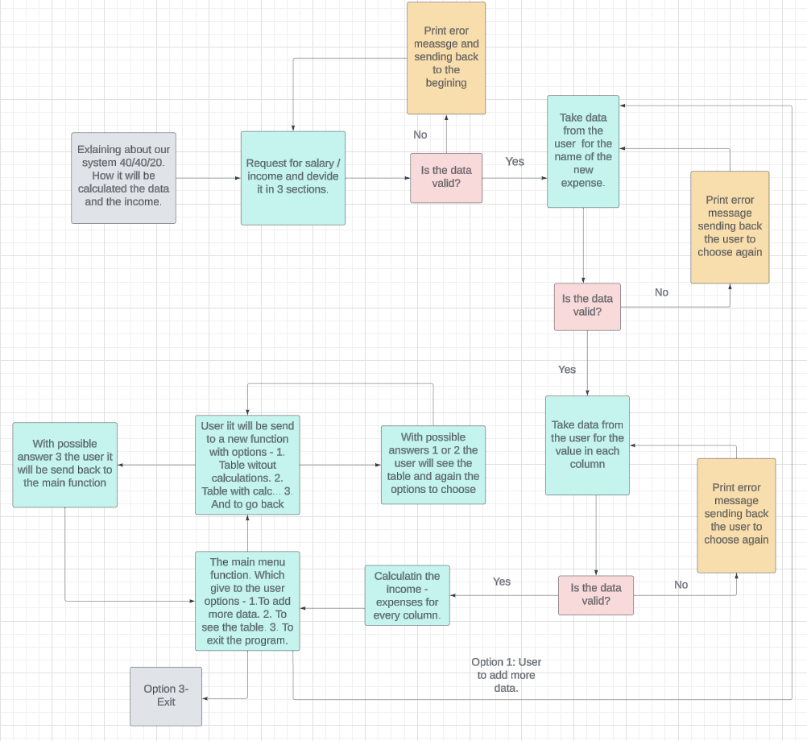

# Salary/Income Calculator

[Lived project can be viewed here](https://calculator-for-salary-6e04ba66476c.herokuapp.com/).

The Salary/Income Calculator is an open-source, interactive command-line utility tailored for efficient income and expense management. It applies the 40/40/20 rule, a guiding principle in wealth creation. According to this rule, 40% of your gross income should be allocated for taxes/needs, another 40% should be saved/invested, and the remaining 20% should cover living expenses. This tool simplifies financial tracking, ensuring users can easily implement this strategy to optimize their savings and budgeting efforts.

## Table of Contents
* [User Stories](#user-stories)
* [Features](#features)
* [Future Features](#future-features)
* [Wireframes](#wireframes)
* [Technology Used](#technology-used)
* [Testing](#testing)
   + [Code Validation](#code-validation)
   + [Bugs](#bugs)
   + [Further Testing](#further-testing)
   + [Feature Testing](#feature-testing)
* [Deployment](#deployment)
* [Credits](#credits)
   + [Content](#content)

   

## User Stories
## Features
## Future Features
## Wireframes
## Technology Used
## Testing
### Code Validation
### Bugs
### Further Testing
### Feature Testing
## Deployment
## Credits
### Credits
