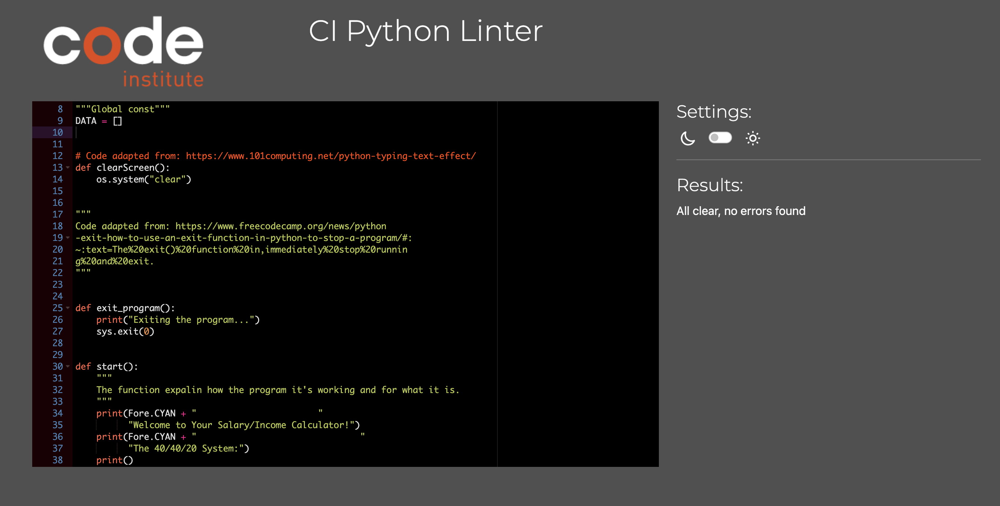

# Salary/Income Calculator

[Lived project can be viewed here](https://calculator-for-salary-6e04ba66476c.herokuapp.com/).

The Salary/Income Calculator is an open-source, interactive command-line utility tailored for efficient income and expense management. It applies the 40/40/20 rule, a guiding principle in wealth creation. According to this rule, 40% of your gross income should be allocated for taxes/needs, another 40% should be saved/invested, and the remaining 20% should cover living expenses. This tool simplifies financial tracking, ensuring users can easily implement this strategy to optimize their savings and budgeting efforts.

## Table of Contents
* [User Stories](#user-stories)
* [Features](#features)
* [Future Features](#future-features)
* [Wireframes](#wireframes)
* [Technology Used](#technology-used)
* [Testing](#testing)
   + [Code Validation](#code-validation)
   + [Bugs](#bugs)
   + [Further Testing](#further-testing)
   + [Feature Testing](#feature-testing)
* [Deployment](#deployment)
   + [Before the deployment of the project](#before-the-deployment-of-the-project)
   + [Deployed in Heroku](#deployed-in-heroku)
* [Credits](#credits)
   + [Content](#content)

   

## User Stories
## Features
## Future Features
## Wireframes
## Technology Used

## Testing
### Code Validation

1. The code was tested with [CI Python Linter](https://pep8ci.herokuapp.com/#).No errors were found in its final testing.

### Bugs
### Further Testing

1. Browsers and devices testing:

Browser | Outcome | Pass/Fail
--- | --- | ---
Google Chrome | No issues. | Pass
Safari | The program starts but no user input is recognized and the program can't continue. | Fail
MacBook Air M1" | No issues with appearance or functionality. | Pass

2. Feedback from friends and family members was sought to identify any bugs or user experience issues.

3. Lighthouse testing on desktop screen:

### Feature Testing
## Deployment

### Before the deployment of the project:
+ With the command `git add.`, all at the command line prompt in your local project directory to add the files or changes to the repository.
+ After, the command `git commit -m` permanently stores the contents of the index in the local repository.
+ In the end, `git push` is used - to upload local repository content to a remote repository.

### Deployed in [Heroku](https://id.heroku.com/login)
1. Updating the `requirements.txt`
+ Run the following command in the terminal: `pip3 freeze > requirements.txt`
+ The update isn't complete until you add, commit, and push the changes to GitHub (keep this in mind).

2. Creating an account in [Heroku](https://id.heroku.com/login).
+ From the Heroku dashbord click on `Create new app`.
+ Enter a name and select a region for the project deployment, then click `Create App`.

3. Navigate to `Settings`tab.
+ In the `Config Vars` add the following information:

      KEY = 'PORT', VALUE = '8000'
+ Then, click the `Add` button.

4. Updating `Buildpacks` in `Settings`:
+ Click `Add Buildpacks`.
+ Select `Python` and then click `Save Changes`.
+ Click `Add Buildpacks` again to add another Buildpacks.
+ Select `nodejs` and click `Save Changes`.

5. Going to the `Deploy` section.
+ Choose `GitHub` as the `Deployment method`.
+ Confirm the connection to `GitHub`.
+ Search for the project by the name our template and click the button `Connect`.
+ Select either `Automatic Deploys` or `Manual Deploys` and click `Deploy Branch`.

6. Once deployment has been completed, click `View` to view the deployed project.

## Credits
### Content

+ The code for the function to clean the screen was adapted from [101computing.net](https://www.101computing.net/python-typing-text-effect/).
+ The code for the function to end the program was adapted from [freecodecamp.org]( https://www.freecodecamp.org/newspython-exit-how-to-use-an-exit-function-in-python-to-stop-a-program/#:~:text=The%20exit()%20function%20in,immediately%20stop%20running%20and%20exit.).
+ How to line break in Python was adapted from [datacamp.com](https://www.datacamp.com/tutorial/how-to-line-break-in-python).
