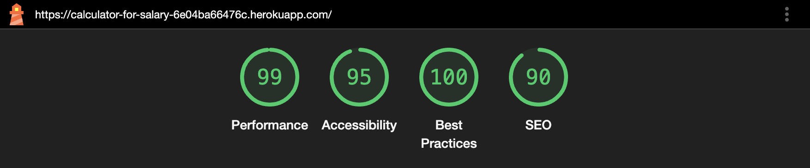
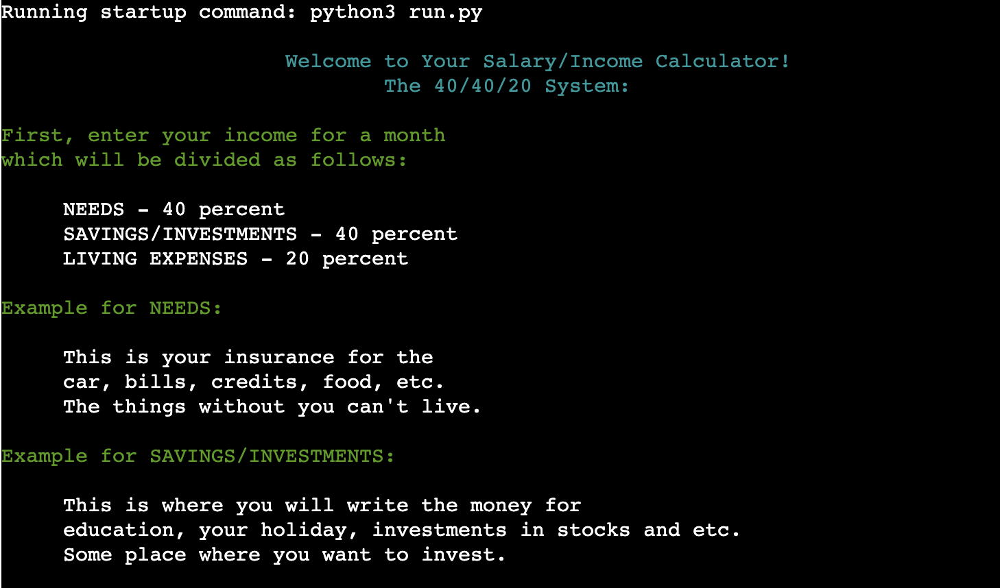
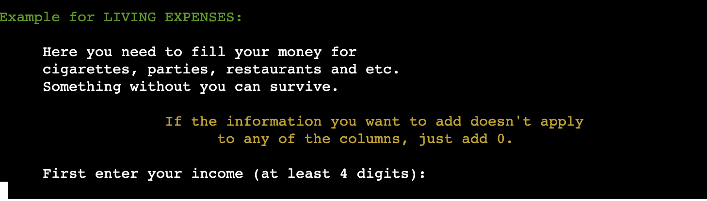
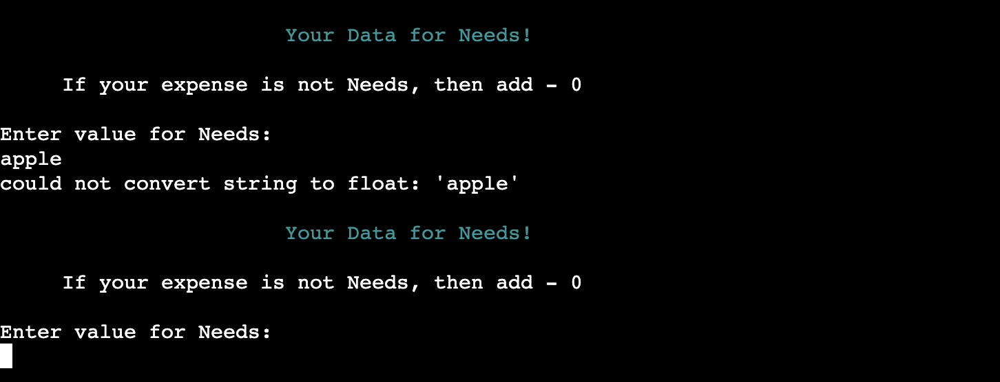
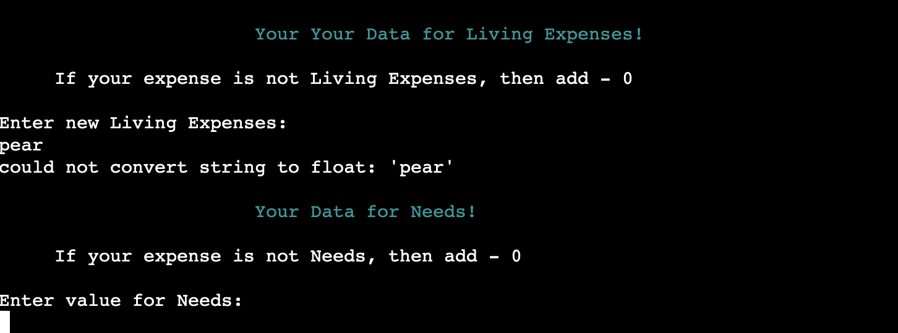
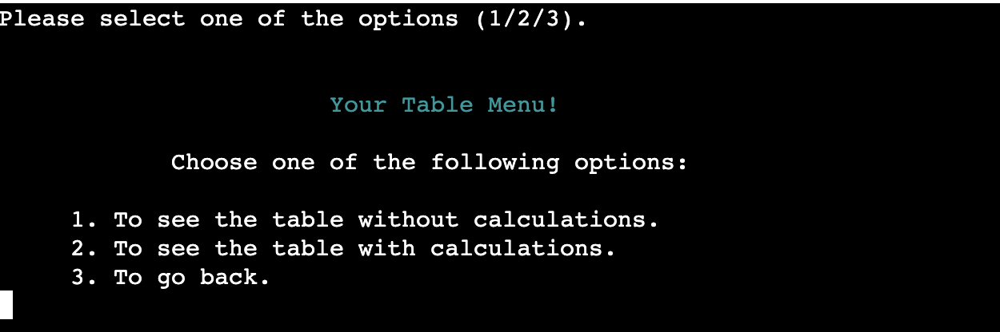

# Salary/Income Calculator

[Lived project can be viewed here](https://calculator-for-salary-6e04ba66476c.herokuapp.com/).

The Salary/Income Calculator is an open-source, interactive command-line utility tailored for efficient income and expense management. It applies the 40/40/20 rule, a guiding principle in wealth creation. According to this rule, 40% of your gross income should be allocated for taxes/needs, another 40% should be saved/invested, and the remaining 20% should cover living expenses. This tool simplifies financial tracking, ensuring users can easily implement this strategy to optimize their savings and budgeting efforts.

## Table of Contents
* [User Stories](#user-stories)
* [Features](#features)
* [Future Features](#future-features)
* [Wireframes](#wireframes)
* [Technology Used](#technology-used)
* [Testing](#testing)
   + [Code Validation](#code-validation)
   + [Bugs](#bugs)
   + [Further Testing](#further-testing)
   + [Feature Testing](#feature-testing)
* [Deployment](#deployment)
   + [Before the deployment of the project](#before-the-deployment-of-the-project)
   + [Deployed in Heroku](#deployed-in-heroku)
   + [Forking the GitHub Repository](#forking-the-github-repository)
   + [Making a Local Clone](#making-a-local-clone)
* [Credits](#credits)
   + [Content](#content)

   

## User Stories
## Features
## Future Features
## Wireframes
## Technology Used

## Testing
### Code Validation

1. The code was tested with [CI Python Linter](https://pep8ci.herokuapp.com/#). No errors were found in its final testing.

### Bugs
### Further Testing

1. Browsers and devices testing:

Browser | Outcome | Pass/Fail
--- | --- | ---
Google Chrome | No issues. | Pass
Safari | The program starts but no user input is recognized and the program can't continue. | Fail
MacBook Air M1" | No issues with appearance or functionality. | Pass
Iphone 15| The program doesen't start. | Fail
Samsung Galaxy A22 | No issues with appearance or functionality. | Pass

2. Feedback from friends and family members was sought to identify any bugs or user experience issues.

3. Lighthouse testing on desktop screen:

### Feature Testing

Feature | Outcome | Screenshot | Pass/Fail
--- | --- | --- | ---
General Screen Function | The logo banner is displayed correctly, providing an overview of the program as intended. Upon completing the start function, the prompt for entering income/salary is presented as expected. |  | Pass
Salary/Income Input Validation | 1. Invalid inputs (e.g., alphabetic characters, special symbols, empty input) trigger an appropriate error message. 2. Inputs with less than 4 digits or negative values also prompt an error.  | 1. 2. | Pass
After the validation of the input for salary/income | After successful validation of the income input, the program transitions to the expenses name input. The banner is displayed correctly at the top, with a brief guide on how to fill out the input field shown accurately below it. The input field is positioned correctly on the screen. |   | Pass
Expenses Name Input Validation | If the input contains invalid characters such as numbers, special symbols, or whitespace, an error message is displayed.  |   | Pass
After the validation of the input for Expenses Name Input | After successful validation of the Expenses Name Input, the program transitions to the Data for Needs input. The banner is displayed correctly at the top, with a brief guide on how to fill out the input field shown accurately below it. The input field is positioned correctly on the screen.  |  | Pass
Data for Needs Input Validation | 1. If the input contains invalid characters such as alphabetic signs an error message is displayed. 2. Or special symbols, whitespace, negative value an error message is displayed. | 1. 2. | Pass
After the validation of the input for Data Needs | After successful validation of the Data Needs Input, the program transitions to the Data for Savings/Inv. input. The banner is displayed correctly at the top, with a brief guide on how to fill out the input field shown accurately below it. The input field is positioned correctly on the screen.  |  | Pass
Data for Savings/Inv. Input Validation | 1. If the input contains invalid characters such as alphabetic signs an error message is displayed and will sent it back to the Needs Input. 2. Or special symbols, whitespace, negative value an error message is displayed and will send the user back to the Needs Input. | 1. 2. | Pass
After the validation of the input for Savings/Inv. | After successful validation of the Savings/Inv. Input, the program transitions to the Data for Living Expenses input. The banner is displayed correctly at the top, with a brief guide on how to fill out the input field shown accurately below it. The input field is positioned correctly on the screen.  |  | Pass
Data for Living Expenses Input Validation | 1. If the input contains invalid characters such as alphabetic signs an error message is displayed and will sent it back to the Needs Input. 2. Or special symbols, whitespace, negative value an error message is displayed and will send the user back to the Needs Input. | 1. 2. | Pass
After the validation of the input Living Expenses | After successful validation of the Living Expenses Input, the program transitions to the Navigation Menu, which give to the user 3 defferent options. The banner is displayed correctly at the top, with a brief guide on how to fill out the input field shown accurately below it. The input field is positioned correctly on the screen.  |  | Pass
Navigation Menu Input Validation | If the input contains invalid characters such as alphabetic signs or special symbols, whitespace, negative value an error message is displayed. |  
Navigation  Menu Validation and Option Selection | After successful validation of the input with possible choices (1, 2, 3), if the user selects option 1 (to add more data), the program transitions back to the Expenses Name input screen. The previos steps repeat until the user returns to the Main Table Menu function. | | Pass
Navigation Menu Validation and Option Selection | After successful validation of the input with possible choices (1, 2, 3), if the user selects option 2 (to see the table), the program transitions to new function with banner "Your Table Menu!" which position is correct. Under the bannerpossible choices (1, 2, 3) for the user to choose the future steps. And in the end input where the user can add his choice. |  | Pass
Table Menu Input Validation | If the input contains invalid characters such as alphabetic signs or special symbols, whitespace, negative value an error message is displayed. |  | Pass
Table Menu Input Validation and Option Selection | After successful validation of the input with possible choices (1, 2, 3),if the user selects option 1 (to see the table without calculations), the table without calculations will be  displayed at the top of the screen. Below the table, the Table Menu with possible choices is presented again. |  | Pass
Table Menu Input Validation and Option Selection | After successful validation of the input with possible choices (1, 2, 3), if the user selects option 2 (to see the table with calculations), the table with calculations will be  displayed at the top of the screen. Below the table, the Table Menu with possible choices is presented again. |  | Pass
Table Menu Input Validation and Option Selection | After validating the input with possible choices (1, 2, 3), if the user selects option 3 (to go back), the program transitions back to the Navigation Menu. |  | Pass
Navigation Menu Validation and Option Selection | After validating the input with possible choices (1, 2, 3), if the user selects option 3 (to exit the program), the program will close.|  | Pass

## Deployment

### Before the deployment of the project:
+ With the command `git add.`, all at the command line prompt in your local project directory to add the files or changes to the repository.
+ After, the command `git commit -m` permanently stores the contents of the index in the local repository.
+ In the end, `git push` is used - to upload local repository content to a remote repository.

### Deployed in [Heroku](https://id.heroku.com/login)
1. Updating the `requirements.txt`
+ Run the following command in the terminal: `pip3 freeze > requirements.txt`
+ The update isn't complete until you add, commit, and push the changes to GitHub (keep this in mind).

2. Creating an account in [Heroku](https://id.heroku.com/login).
+ From the Heroku dashbord click on `Create new app`.
+ Enter a name and select a region for the project deployment, then click `Create App`.

3. Navigate to `Settings`tab.
+ In the `Config Vars` add the following information:

      KEY = 'PORT', VALUE = '8000'
+ Then, click the `Add` button.

4. Updating `Buildpacks` in `Settings`:
+ Click `Add Buildpacks`.
+ Select `Python` and then click `Save Changes`.
+ Click `Add Buildpacks` again to add another Buildpacks.
+ Select `nodejs` and click `Save Changes`.

5. Going to the `Deploy` section.
+ Choose `GitHub` as the `Deployment method`.
+ Confirm the connection to `GitHub`.
+ Search for the project by the name our template and click the button `Connect`.
+ Select either `Automatic Deploys` or `Manual Deploys` and click `Deploy Branch`.

6. Once deployment has been completed, click `View` to view the deployed project.

### Forking the GitHub Repository
By forking the GitHub Repository we make a copy of the original repository on our GitHub account to view and/or make changes without affecting the original repository by using the following steps...

1. Log in to GitHub and locate the GitHub Repository
2. At the top of the Repository between the Watch and Star buttons on the menu, is the "Fork" Button.
3. You should now have a copy of the original repository in your GitHub account.

### Making a Local Clone
To clone this repository, follow these steps:

1. On the repository's GitHub page, click on the Code button.
2. In the dropdown, click on Clone to copy the repository's URL to your clipboard.
3. Open your terminal.
4. Go to the directory where you want to clone the repository.
5. Use the git clone command followed by the URL you copied, then hit ENTER.
6. Done, cloned to your local machine!

## Credits
### Content

+ The code for the function to clean the screen was adapted from [101computing.net](https://www.101computing.net/python-typing-text-effect/).
+ The code for the function to end the program was adapted from [freecodecamp.org]( https://www.freecodecamp.org/newspython-exit-how-to-use-an-exit-function-in-python-to-stop-a-program/#:~:text=The%20exit()%20function%20in,immediately%20stop%20running%20and%20exit.).
+ How to line break in Python was adapted from [datacamp.com](https://www.datacamp.com/tutorial/how-to-line-break-in-python).
